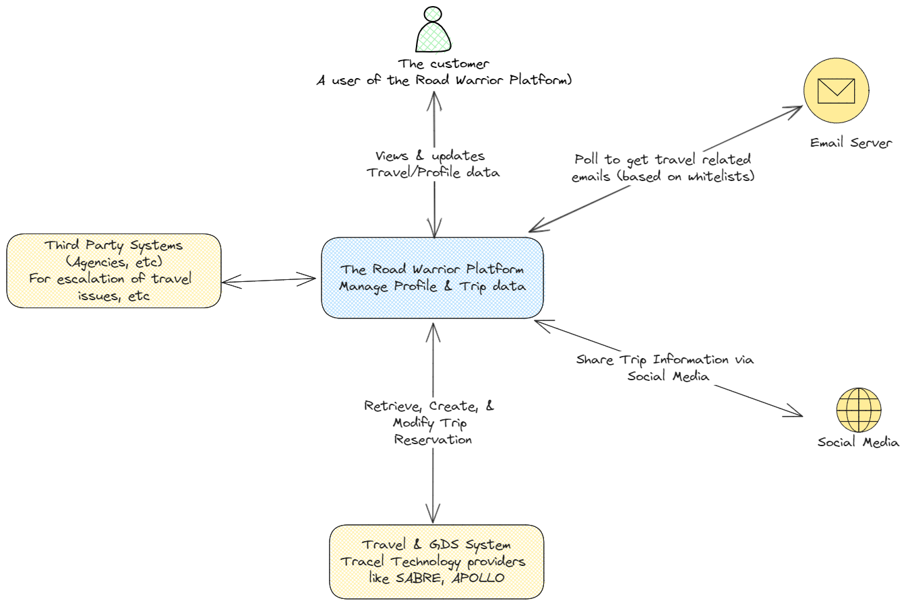
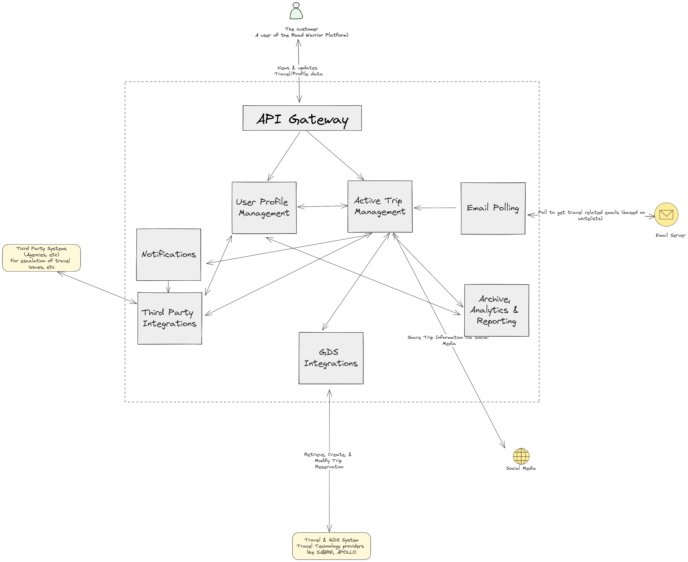
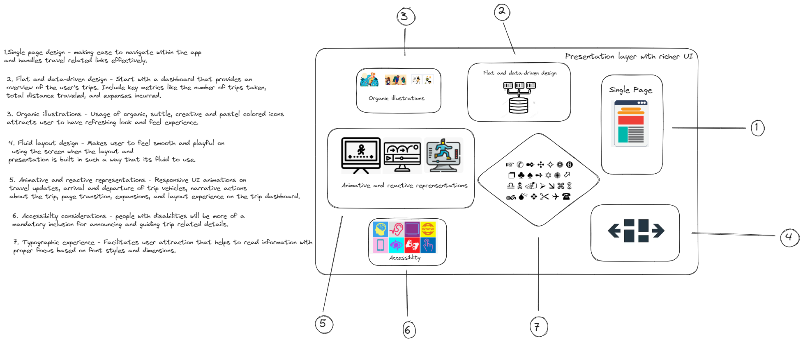
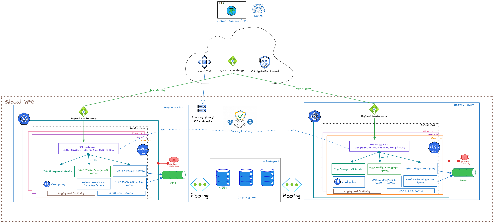
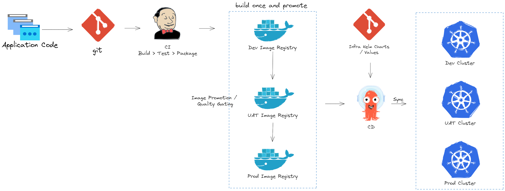

# Team Flatirons - O'Reilly Architectural Katas - September 2023

## The Road Warrior Platform

## Table of Contents
  - [Overview](#overview)
  - [Recommended Domain Learning](#recommended-domain-learning)
  - [Functional requirements](#functional-requirements)
  - [Non-functional requirements](#non-functional-requirements)
  - [Architecture Approach](#architecture-approach)
    - [Level 1: System Context Diagram](#system-context-diagram)
    - [Level 2: Container Diagram](#container-diagram)
    - [Level 3: Component Diagram](#component-diagram)
    - [Traceability Matrix](#traceability-matrix)
  - [UI Design](#ui-design)
  - [Deployment Architecture](#deployment-architecture)
  - [Architectural Decision Records (ADRs)](#architectural-decision-records)
  - [About Team Flatirons](#about-the-team)
  - [Glossary](#glossary)
  - [References](#references)

## Overview
The Road Warrior is new startup that wants to build the next generation online trip management dashboard to allow travelers to see all of their existing reservations organized by trip either online (web) or through their mobile device.

## Recommended domain learning
It is important to understand the domain better when developing a solution. Important concepts to understand in the travel and hospitality domain that are relevant to this project are given below:

### Global Distribution System
A Global Distribution System (GDS) is a computerised network system owned or operated by a company that enables transactions between travel industry service providers, mainly airlines, hotels, car rental companies, and travel agencies. The GDS mainly uses real-time inventory (e.g. number of hotel rooms available, number of flight seats available, or number of cars available) from the service providers. Travel agencies traditionally relied on GDS for services, products and rates in order to provide travel-related services to the end consumers. Thus, a GDS can link services, rates and bookings consolidating products and services across all three travel sectors: i.e., airline reservations, hotel reservations, car rentals. 

Learning References:
* [Wikipedia - Global Distribution System](https://en.wikipedia.org/wiki/Global_distribution_system)
* [Global Distribution System (GDS) – An Ultimate Guide](https://happay.com/blog/global-distribution-system-gds/)

The two GDS systems that will be used for the first iteration of this project are SABRE and APOLLO.

### Standard API documentation:
For this project, integration with two following GDS systems will be in scope
* SABRE - https://developer.sabre.com/home
* APOLLO - https://www.travelopro.com/best-travel-API.php

## Functional Requirements

The following functional requirements have been extracted from the requirements document provided [here](https://on24static.akamaized.net/event/43/16/26/7/rt/1/documents/resourceList1694028463535/fall2023architecturalkatasimportantdates1694028462631.pdf). All of the requirements listed below are considered MUST-HAVE for the project.

| Requirement ID | Requirement |
| ----------- | ----------- |
| FR-1 | Poll email looking for travel-related emails |
| FR-2 | Filter and whitelist certain emails |
| FR-3 | The system must interface with the agency’s existing airline, hotel, and car rental interface system to update travel details (delays, cancellations, updates, gate changes, etc.). |
| FR-4 | Customers should be able to add, update, or delete existing reservations manually as well. |
| FR-5 | Items in the dashboard should be able to be grouped by trip, and once the trip is complete, the items should automatically be removed from the dashboard. |
| FR-6 | Users should also be able to share their trip information by interfacing with standard social media sites or allowing targeted people to view your trip. |
| FR-7 | Richest user interface possible across all deployment platforms |
| FR-8 | Provide end-of-year summary reports for users with a wide range of metrics about their travel usage. |
| FR-9 | Road Warrior gathers analytical data from users trips for various purposes - travel trends, locations, airline and hotel vendor preferences, cancellation and update frequency, and so on. |
| FR-10 | Must integrate seamlessly with existing travel systems (i.e, SABRE, APOLLO) |
| FR-11 | Must integrate with preferred travel agency for quick problem resolution (the ability to reach out to specific travel agencies for help) |
| FR-12 | Must work internationally |
| FR-13 | (Derived) Notifications should be sent to users on flight delays, reschedules, etc |

## Non-Functional Requirements
The following non-functional requirements have been extracted from the requirements document provided [here](https://on24static.akamaized.net/event/43/16/26/7/rt/1/documents/resourceList1694028463535/fall2023architecturalkatasimportantdates1694028462631.pdf). All of the requirements listed below are considered MUST-HAVE for the project.

| Requirement ID | Requirement |
| ----------- | ----------- |
| NFR-1 | Should support 2 million active users/week |
| NFR-2 | Should support a total of 15 million user accounts |
| NFR-3 | Users must be able to access the system at all times (max 5 minutes per month of unplanned downtime) |
| NFR-4 | Travel updates must be presented in the app within 5 minutes of generation by the source |
| NFR-5 | Response time from web (800ms) and mobile (First-contentful paint of under 1.4 sec) |

## Architecture Approach

We will use the C4 modelling technique to describe our solution initially treating the system as black box while identifying external actors and use cases. At each subsequent level we will zoom into the black box to describe the containers, its consitituent components, their inter-dependencies and communication mechanisms.

### Level 1: System Context Diagram
We use the system Context diagram as a good starting point for diagramming and documenting the architecture. The "Road Warrior" software can be seen below surrounded by its users and the other systems that it interacts with.

### Level 2: Container Diagram
We break down the earlier diagram to show the high-level shape of the software architecture and how responsibilities are distributed across it. We also show the major technology choices and how the containers communicate with one another.

We have also added an API layer to extract the publically accessible interface of the system. Instead of external users directly connecting to the individual services via a GUI, all external requests will be routed through the API layer. (Refer [ADR-002](./adr/adr-002-use-of-api-layer.md))

### Level 3: Component Diagram
The Component diagram shows how each container is made up of a number of "components", what each of those components are, their responsibilities and the technology/implementation details. The previous diagram showed 8 distinct containers including the API layer. Since the API layer is simply a proxy, it does not include any domain specific functionality or perform any workflow orchestration, we can omit it from this section. For each of the containers a Component Diagram is provided, followed by identifying architecture characteristics and the appropriate architecture style.

* [User Profile Management](./containers/user-profile-management.md)
* [Active Trip Data Management](./containers/active-trip-management.md)
* [Email Polling](./containers/email-polling.md)
* [Notifications](./containers/notifications.md)
* [GDS Integrations](./containers/gds-integrations.md)
* [Archive, Analytics & Reporting](./containers/archive-reports-analytics.md)
* [Third Party Integrations](./containers/third-party-integrations.md)

## Traceability Matrix
We have mapped all of the functional requirements to the components. The non-fuctional requirements are not mapped as they will be addressed by the depoyment architecture covered in the next section.
| Requirement ID | Requirement | Covered by |
| ----------- | ----------- | ----------- |
| FR-1 | Poll email looking for travel-related emails | Email Polling |
| FR-2 | Filter and whitelist certain emails | Email Polling |
| FR-3 | The system must interface with the agency’s existing airline, hotel, and car rental interface system to update travel details (delays, cancellations, updates, gate changes, etc.). | Active Trip Data Management, GDS Integrations, Third Party Integrations |
| FR-4 | Customers should be able to add, update, or delete existing reservations manually as well. | Active Trip Data Management |
| FR-5 | Items in the dashboard should be able to be grouped by trip, and once the trip is complete, the items should automatically be removed from the dashboard. | Active Trip Data Management |
| FR-6 | Users should also be able to share their trip information by interfacing with standard social media sites or allowing targeted people to view your trip. | Active Trip Data Management, Third Party Integrations |
| FR-7 | Richest user interface possible across all deployment platforms | Active Trip Data Management |
| FR-8 | Provide end-of-year summary reports for users with a wide range of metrics about their travel usage. | Archive, Reports & Analytics |
| FR-9 | Road Warrior gathers analytical data from users trips for various purposes - travel trends, locations, airline and hotel vendor preferences, cancellation and update frequency, and so on. | Archive, Reports & Analytics |
| FR-10 | Must integrate seamlessly with existing travel systems (i.e, SABRE, APOLLO) | GDS Integrations |
| FR-11 | Must integrate with preferred travel agency for quick problem resolution (the ability to reach out to specific travel agencies for help) | GDS Integrations, Third Party Integrations |
| FR-12 | Must work internationally | User Profile Management, Active Trip Data Management |
| FR-13 | (Derived) Notifications should be sent to users on flight delays, reschedules, etc | User Profile Management, Active Trip Data Management, Notifications |

## UI Design

Since one of the specific requirements for this platform is a rich UI we recommend designing the presentation layer using the following UI/UX design elements

## Deployment Architecture
The next diagram models a deployment of the Road Warrior platform. We will assume to use Kubernetes for container orchestration, automating software deployment, scaling, and management. We propose a multi-region deployment architecture - the diagram shows how the app may be deployed in 2 sample regions. We also propose the use of an app cache (refer [ADR-003](./adr/adr-003-use-of-app-cache.md)) to help meet the stringent perforamce requirements set for the platform.

It is suggested to use the following CI/CD pipeline for automated deployments with the proposed deployment architecture.

## Architectural Decision Records

[ADR-001 Template](./adr/adr-001-template.md)

[ADR-002: Use of an API layer as the externally accessible interface to the system](./adr/adr-002-use-of-api-layer.md)

[ADR-003: Use of an App Cache](./adr/adr-003-use-of-app-cache.md)

## About Team Flatirons

We are a group of software engineers from an organization that provides a [leading aerospace technical content and maintenance task management platform](https://www.flatironssolutions.com/).

* [Balakumaran Palanivel](https://www.linkedin.com/in/bala-kumaran-9427aa16/)
* Gayathri Lakshminarayanan
* [Subathra Gandhi Pushpavalli](https://www.linkedin.com/in/subathra-gandhi-623ab1a9/) 
* [Viswanaath Selvaraj](https://www.linkedin.com/in/viswanaath-selvaraj-4950a296/) 
* [Varun Krishnan](https://www.linkedin.com/in/varunvkrishnan/) 

## Glossary
* GDS - Global Disitribution System
* NFR - Non-Functional Requirement
* UI - User Interface
* UX - User Experience

## References
[1] [O'Reilly Software Architecture Kata Entries](https://github.com/tekiegirl/SoftwareArchitectureResources/blob/main/Resources/OReillyKata.md)

[2] [Fundamentals of Software Architecture](https://learning.oreilly.com/library/view/fundamentals-of-software/9781492043447/)

[3] [Building Evolutionary Architectures](https://learning.oreilly.com/library/view/building-evolutionary-architectures/9781491986356/)

[4] [C4 Model](https://c4model.com/)

[5] [DeveloperToArchitect.com Resources](https://www.developertoarchitect.com/resources.html)

