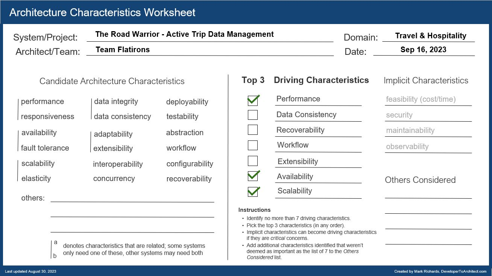

## Component Diagram - Active Trip Data Management

### Responsibilities

1.  Interface with the agency’s existing airline, hotel, and car rental interface system to update travel details (delays, cancellations, updates, gate changes, etc.).
2. Provide ability to add, update, or delete existing reservations manually as well.
3. Provide dashboard where the user should be able to be grouped by trip, and once the trip is complete, the items should automatically be removed from the dashboard.
4. Provide ability for users to share their trip information.
5. Provide richest user interface possible across all deployment platforms.
6. Provide support for users across geographies and languages.
7. Provide data required to trigger notifications to be sent to users on flight delays, reschedules, etc

### Driving Architectural Characteristics

### Architectural Style Preferred

