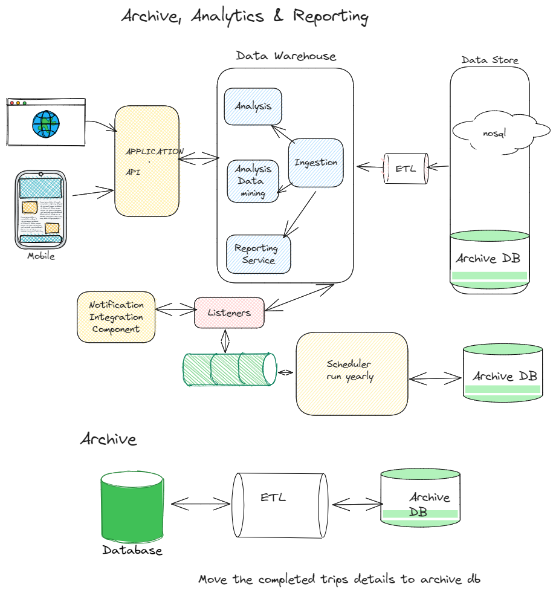
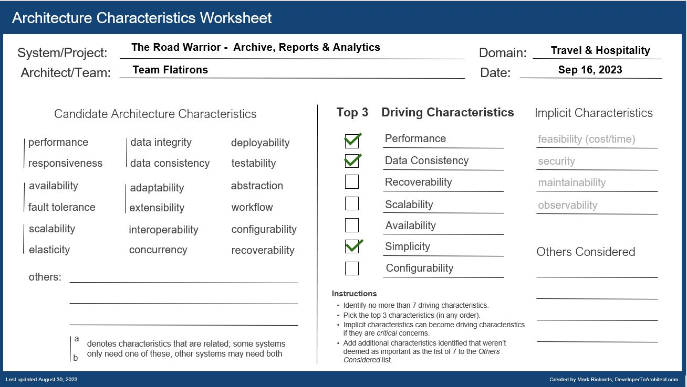
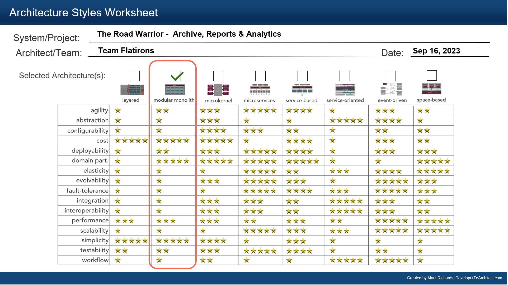

## Component Diagram - Archive, Analytics & Reporting

### Responsibilities

1. Provide end-of-year summary reports for users with a wide range of metrics about their travel usage.
2. Gather analytical data from users trips for various purposes - travel trends, locations, airline and hotel vendor preferences, cancellation and update frequency, and so on.

### Driving Architectural Characteristics

### Architectural Style Preferred

