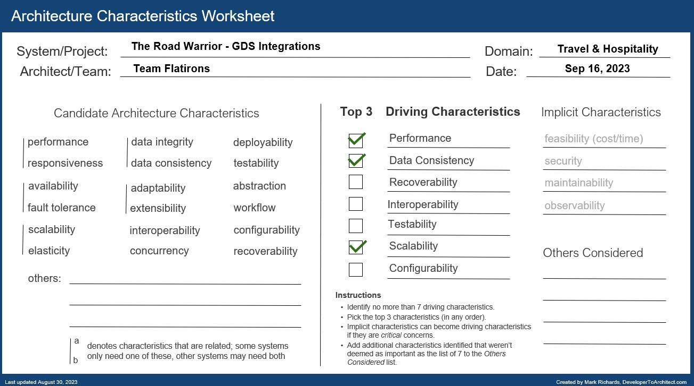
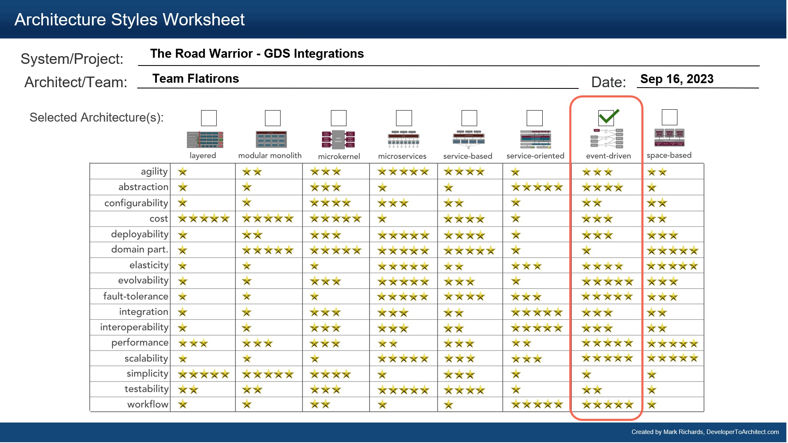

## Component Diagram - GDS Integrations

### Responsibilities

1. Interface with the agency’s existing airline, hotel, and car rental interface system to update travel details (delays, cancellations, updates, gate changes, etc.).
2. Integrate seamlessly with existing travel systems (i.e, SABRE, APOLLO)
3. Integrate with preferred travel agency for quick problem resolution (the ability to reach out to specific travel agencies for help)

### Driving Architectural Characteristics

### Architectural Style Preferred

