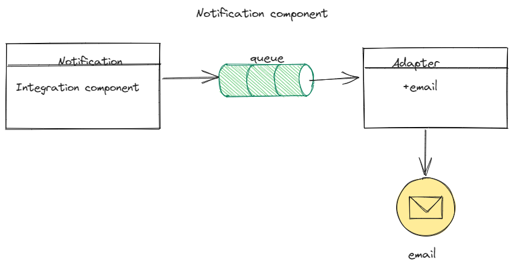
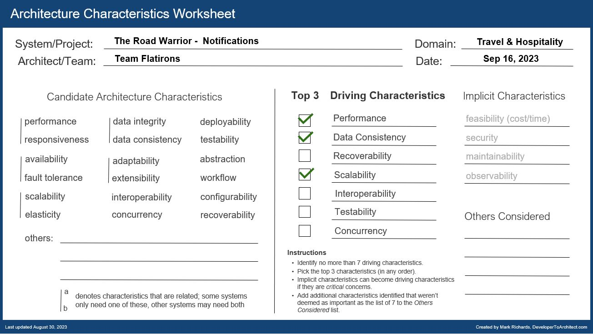
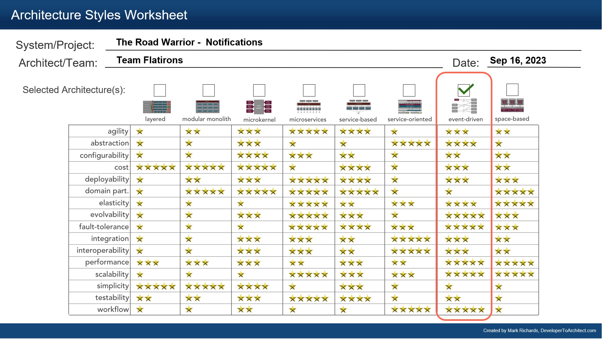

## Component Diagram - Notifications

### Responsibilities

1. Send notifications should be sent to users on flight delays, reschedules, etc

### Driving Architectural Characteristics

### Architectural Style Preferred

