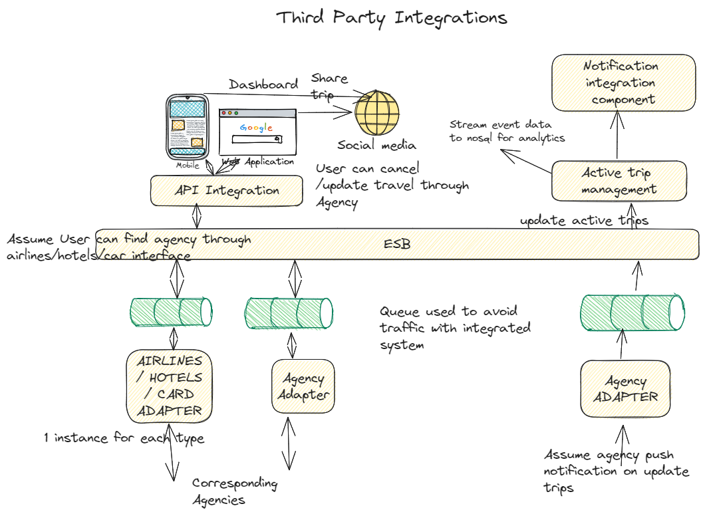
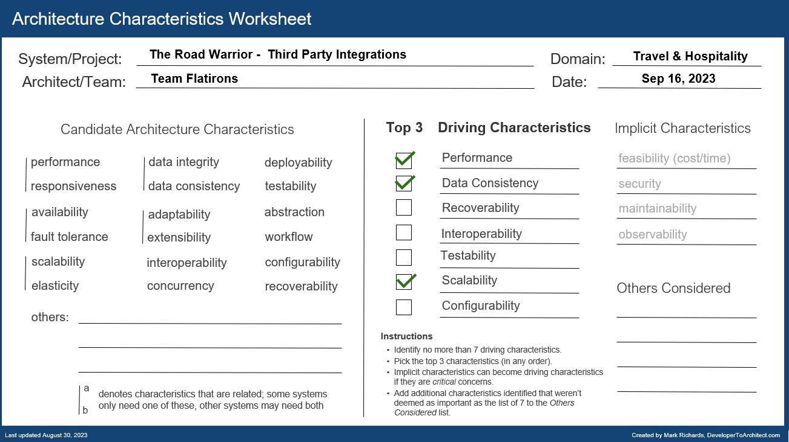

## Component Diagram - Third Party Integrations

### Responsibilities

1. Interface with the agency’s existing airline, hotel, and car rental interface system to update travel details (delays, cancellations, updates, gate changes, etc.).
2. Provide ability to share their trip information by interfacing with standard social media sites or allowing targeted people to view your trip.
3. Integrate with preferred travel agency for quick problem resolution (the ability to reach out to specific travel agencies for help)

### Driving Architectural Characteristics

### Architectural Style Preferred

