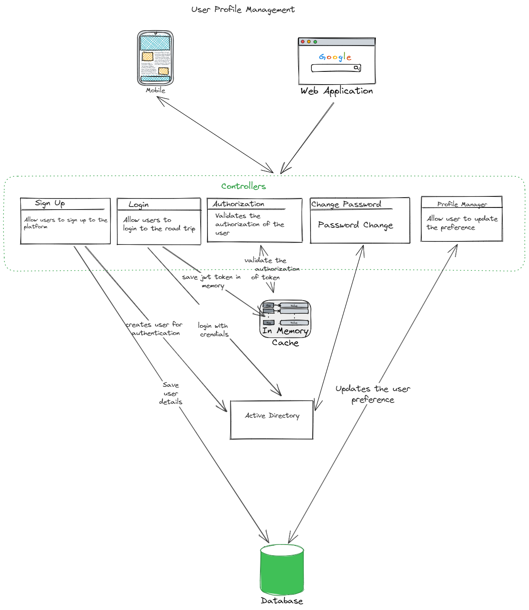

## Component Diagram - User Profile Management

### Responsibilities

1. Manage complete user profile & preferences such as language, etc
2. Manage authentication & authorization
2. Manage data required to send notifications on flight delays, reschedules, etc

### Driving Architectural Characteristics

### Architectural Style Preferred

